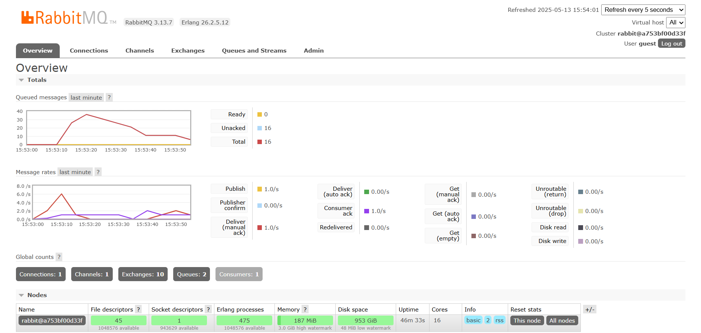

# Advanced Programming - Module 09 Rust Subscriber
**Nama:**   &nbsp; Stefanus Tan Jaya 
**NPM:**    &nbsp;&ensp; 2306152456 
**Kelas:**  &nbsp; Pemrograman Lanjut A 

### Questions
1. What is `amqp`? 
    AMQP (Advanced Message Queuing Protocol) adalah standar protokol untuk _message-oriented middleware_. Hal ini memungkinkan pertukaran pesan antar aplikasi yang berbeda dalam sistem terdistribusi. AMQP menggunakan model _queue_ dan _exchange_ yang fleksibel. Ketika sebuah aplikasi mem-_publish_ pesan ke sebuah _exchange_, AMQP _broker_  akan meneruskannya ke satu atau lebih _queue_ berdasarkan _key_ dan _binding_ yang telah dikonfigurasi. _Consumer_ kemudian membaca pesan-pesan tersebut dari _queue_ masing-masing, memprosesnya, dan melakukan _acknowledgment_ kembali ke _broker_. Mekanisme ini memastikan bahwa pesan tidak hilang dan dapat diulang pemrosesannya jika terjadi kegagalan, sehingga _high reliability and interoperability_.  
2. What does it mean? `guest:guest@localhost:5672`, what is the first guest, and what is the second guest, and what is `localhost:5672` is for? 
    `guest:guest@localhost:5672` mengikuti format _default credential_ untuk mengakses AMQP _broker_ seperti RabbitMQ di komputer lokal (`localhost`) dengan port 5672. _First_ guest berupa `username` yang digunakan untuk autentikasi ke AMQP _broker_ dan _second_ guest berupa `password` untuk _user_ guest.  

  
Bisa dilihat pada grafik Queued Messages terjadi peningkatan karena banyak pesan yang dikirim ke _broker_ oleh Publisher, namun belum semuanya diproses oleh Subscriber yang lebih lambat. Dari gambar di atas, mesin saya memiliki 35 _queue_. Hal ini terjadi akibat Subscriber perlu waktu lebih lama untuk memproses tiap event/pesan yang berada di _message queue_, sehingga terjadi penumpukkan pada _queue_ karena Publisher lebih cepat mem-_publish_ pesan daripada Subscriber memprosesnya.